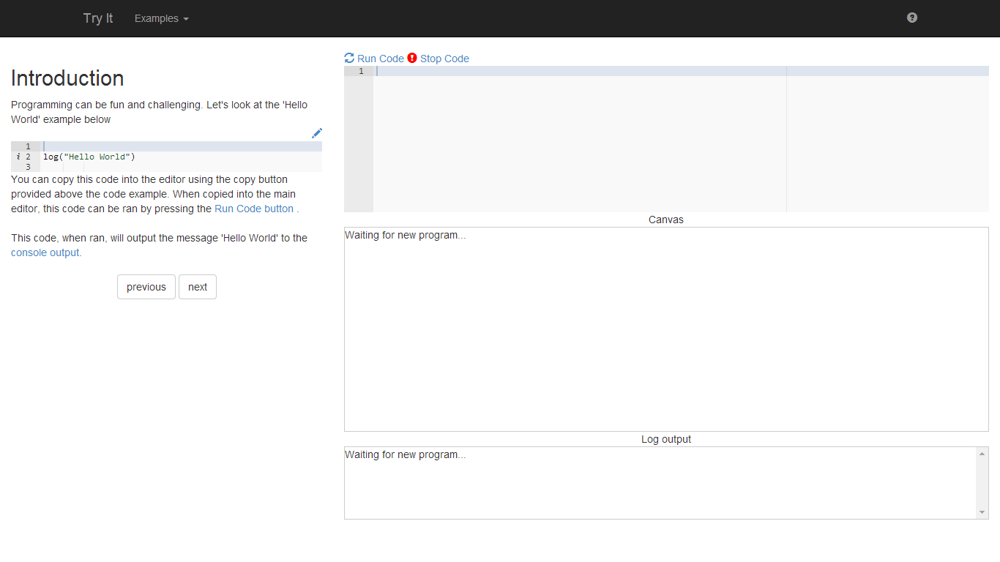
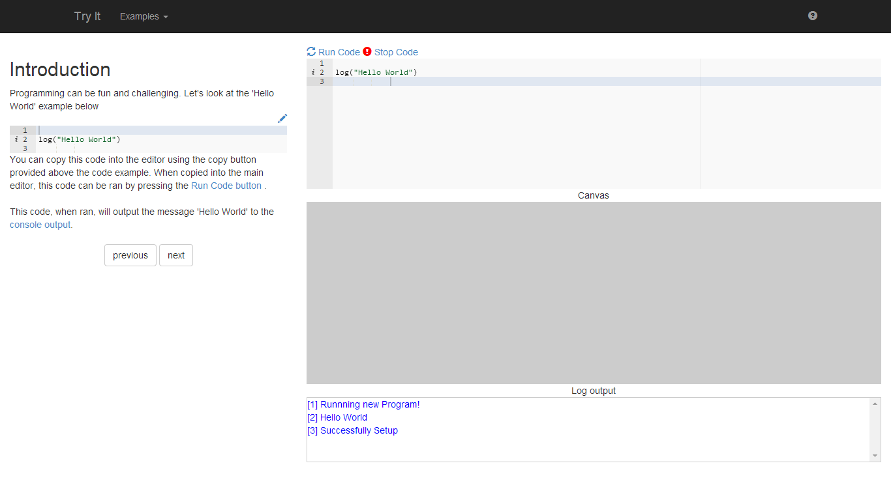
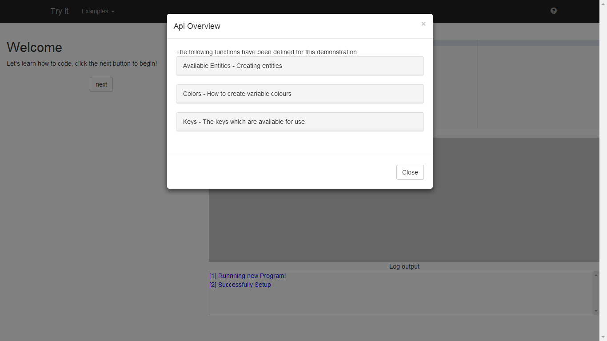
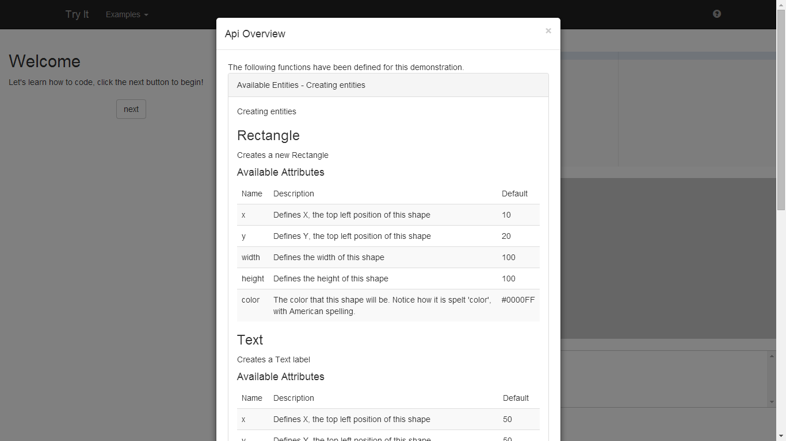
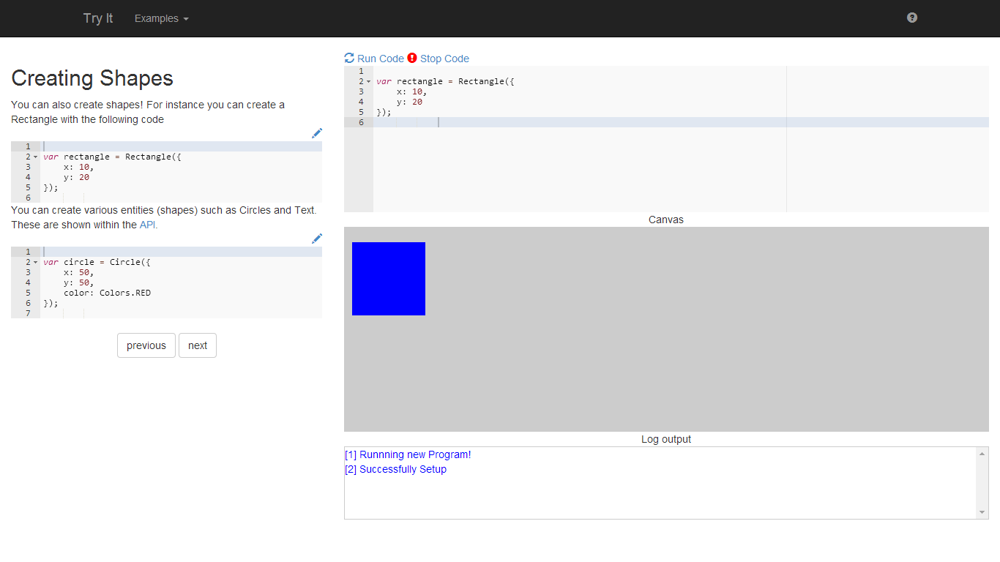
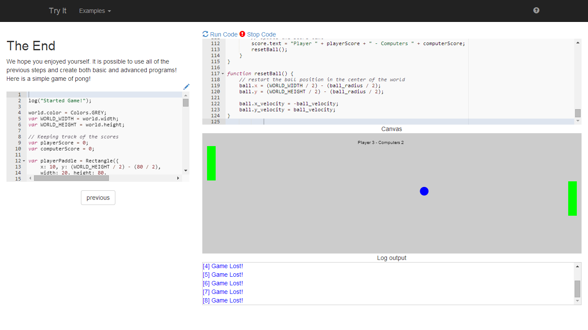

CodeRunner
==========

There are various websites out there that allow for students who are new to programming to learn more about programming. This is often in the form of a REPL (Read Eval Print Loop), and is not very friendly to new programmers. Instead this application allows for a visual representation of code, which allows for students to create games of all levels of intricacy. 

Pictures
========

Technologies
============

- JavaScript
- BackBone.js
- BootStrap
- Bower

Running
=======

- Ensure that bower is installed. This can be achieved with `npm install -g bower`, and running `bower install` from the source directory.
- Open index.html